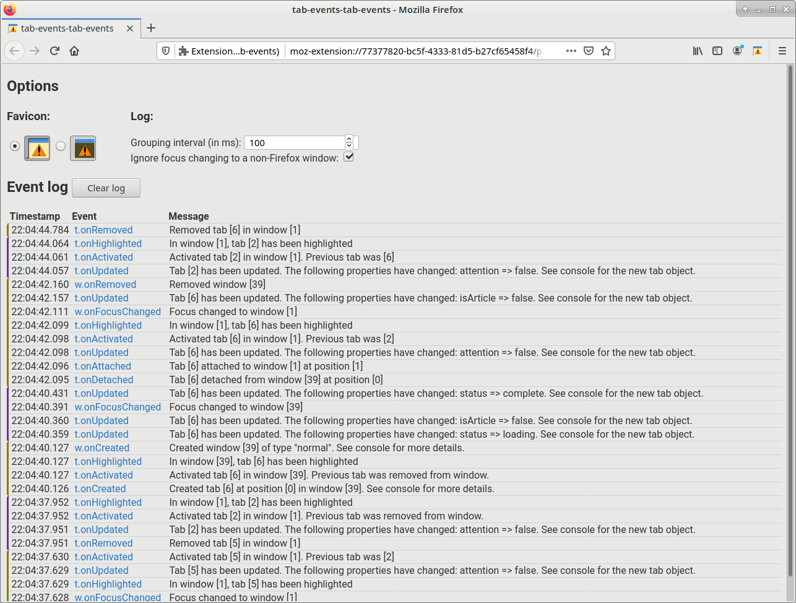

# tabs-events-tab-events

A web browser addon that prints out tab-related events.

## Preview



## Installation

Download it from [Firefox addons](https://addons.mozilla.org/firefox/addon/tab-events-tab-events/).

## Usage

Click on the addon icon to open the log page.

## Development

### Building

```bash
npm run build
```

Creates `build/tete.zip`.

### Testing

Launch a Firefox window with the addon installed.

```bash
npm run run
```

### Linting

The project uses ESLint. Use comments to ignore annoying errors.

```bash
npm run lint
npm run fix # To fix automatically
```

### Icon

`icon.svg` is edited in Inkscape, which is then saved as a plain SVG as `icon.plain.svg`. This one is exported as `icon-128.png` for AMO's page.

`icon-dark.svg` is the icon for Firefox's dark theme. It is saved as a plain SVG in `icon-dark.plain.svg`.

## Changelog

[CHANGELOG](CHANGELOG.md)

## License

[Artistic-2.0](LICENSE)
