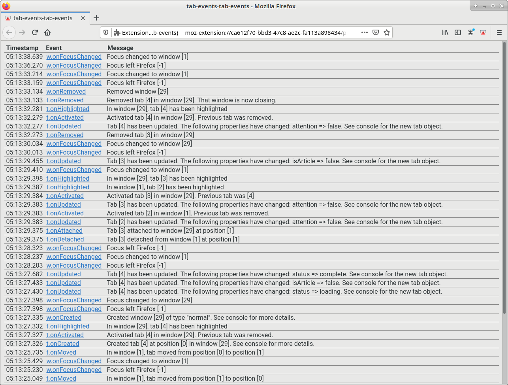

# tabs-events-tab-events

A utility addon that prints out tab related events.

## Preview



## Installation

Make sure you have `npm` installed

```bash
npm install
```

## Usage

Click on the addon icon to open the log page.

## Development

This addon isn't really meant to be distributed yet. You can probably just use web-ext. Look it up online.

### Testing

Launch a Firefox window with the addon installed.

```bash
npm run run
```

### Linting

The project uses ESLint. Use comments to ignore annoying errors.

```bash
npm run lint
```

### Icon

`icon.svg` is edited in Inkscape, which is then saved as a plain SVG as `icon.plain.svg`.
